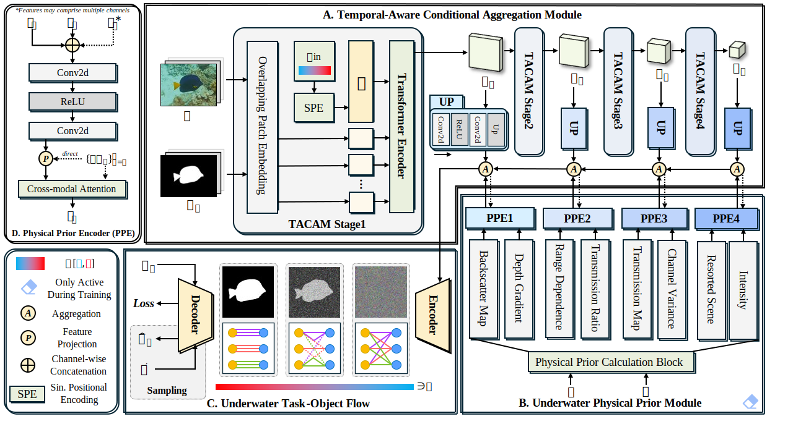

# WaterFlow: Explicit Physics-Prior Rectified Flow for Underwater Saliency Mask Generation

[Runting Li](https://github.com/Theo-polis), Shijie Lian, Hua Li, Yutong Li, Wenhui Wu, Sam Kwong

This repository is the official implementation of "WaterFlow: Explicit Physics-Prior Rectified Flow for 
Underwater Saliency Mask Generation" (ICASSP 2026).


## Overview

Underwater Salient Object Detection (USOD) faces significant challenges including image quality 
degradation and domain gaps caused by light absorption and scattering in water. Existing methods 
tend to ignore the physical principles of underwater imaging, or treat degradation phenomena purely 
as interference to be removed, failing to exploit the valuable information they contain.

We propose WaterFlow, a rectified flow-based framework that incorporates underwater physical imaging 
information as explicit priors directly into the network training process. Specifically, we adopt the 
SeaThru image formation model to decompose each underwater image into backscatter and direct 
transmission components, and inject these physics-derived features into a PVT backbone at multiple 
scales during training. At inference time, the model inherits the physically grounded representations 
learned during training without requiring depth input.

## Architecture



## Key Contributions

- **Explicit Physical Prior Integration**: WaterFlow incorporates underwater physical imaging 
  information (based on the SeaThru model) as explicit prior knowledge directly into the training 
  process, guiding the backbone to learn physically grounded feature representations.

- **Rectified Flow for USOD**: We are the first to systematically apply Rectified Flow to underwater 
  salient object detection, replacing the DDPM framework in CamoDiffusion with a more efficient 
  straight-trajectory formulation.

- **Temporal Dimension Modeling**: We introduce time ensemble strategies that leverage intermediate 
  denoising steps to improve prediction robustness.

- **State-of-the-Art Performance**: WaterFlow achieves substantial improvements on USOD10K and 
  UFO-120 benchmarks.

## Requirements

- Python == 3.10
- CUDA == 12.6
- torch == 2.7.1
```bash
pip install -r requirements.txt
```

> **Note**: `mmcv-full==1.7.2` requires a separate installation step:
> ```bash
> pip install -U openmim
> mim install mmcv-full==1.7.2
> ```

## Datasets

Download the following underwater SOD datasets and organize them as follows:
```
media/dataset/
        ├── USOD10K/
        │   ├── TrainDataset/
        │   │   ├── Imgs/
        │   │   ├── GT/
        │   │   └── DepRaw/
        │   └── TestDataset/
        │       ├── Imgs/
        │       └── GT/
        ├── UFO120/
        │   └── TestDataset/
        │       ├── Imgs/
        │       └── GT/
        ├── SUIM/
        └── USOD/
```

- [USOD10K](https://github.com/LinHong-HIT/USOD10K)
- [UFO-120](https://irvlab.cs.umn.edu/resources/ufo-120-dataset)
- [SUIM](https://irvlab.cs.umn.edu/resources/suim-dataset)

## Training

Train at 352×352:
```bash
accelerate launch train.py \
  --config config/waterflow_352x352.yaml \
  --num_epoch=150 \
  --batch_size=8 \
  --gradient_accumulate_every=4
```

Fine-tune at 384×384:
```bash
accelerate launch train.py \
  --config config/waterflow_384x384.yaml \
  --num_epoch=20 \
  --batch_size=8 \
  --gradient_accumulate_every=4 \
  --pretrained results/${RESULT_DIRECTORY}/model-best.pt \
  --lr_min=0 \
  --set optimizer.params.lr=1e-5
```

## Evaluation
```bash
accelerate launch sample.py \
  --config config/waterflow_384x384.yaml \
  --results_folder ${RESULT_SAVE_PATH} \
  --checkpoint ${CHECKPOINT_PATH} \
  --num_sample_steps 1 \
  --target_dataset USOD10K
```

## Acknowledgements

## Acknowledgements

This project is built on top of [CamoDiffusion](https://github.com/Rapisurazurite/CamoDiffusion).
The underwater physics model is based on [Sea-Thru](https://openaccess.thecvf.com/content_CVPR_2019/papers/Akkaynak_Sea-Thru_A_Method_for_Removing_Water_From_Underwater_Images_CVPR_2019_paper.pdf) (Akkaynak & Treibitz, CVPR 2019).
The backbone follows [PVTv2](https://github.com/whai362/PVT).
The diffusion framework is based on [DDPM](https://arxiv.org/abs/2006.11239) (Ho et al., NeurIPS 2020) and [Rectified Flow](https://arxiv.org/abs/2209.03003) (Liu et al., ICLR 2023), with implementations from [denoising-diffusion-pytorch](https://github.com/lucidrains/denoising-diffusion-pytorch) and [rectified-flow-pytorch](https://github.com/lucidrains/rectified-flow-pytorch) by lucidrains.

## Citation

If you find this work useful, please cite:
```bibtex
@inproceedings{li2026waterflow,
  title     = {WaterFlow: Explicit Physics-Prior Rectified Flow for Underwater Saliency Mask Generation},
  author    = {Li, Runting and Lian, Shijie and Li, Hua and Li, Yutong and Wu, Wenhui and Kwong, Sam},
  booktitle = {ICASSP},
  year      = {2026}
}
```

This work extends CamoDiffusion. If you use this repository, please also consider citing:
```bibtex
@article{chen2023camodiffusion,
  title   = {CamoDiffusion: Camouflaged Object Detection via Conditional Diffusion Models},
  author  = {Chen, Zhongxi and Sun, Ke and Lin, Xianming and Ji, Rongrong},
  journal = {arXiv preprint arXiv:2305.17932},
  year    = {2023}
}

@article{sun2025conditional,
  title     = {Conditional Diffusion Models for Camouflaged and Salient Object Detection},
  author    = {Sun, Ke and Chen, Zhongxi and Lin, Xianming and Sun, Xiaoshuai and Liu, Hong and Ji, Rongrong},
  journal   = {IEEE Transactions on Pattern Analysis and Machine Intelligence},
  year      = {2025},
  publisher = {IEEE}
}
```